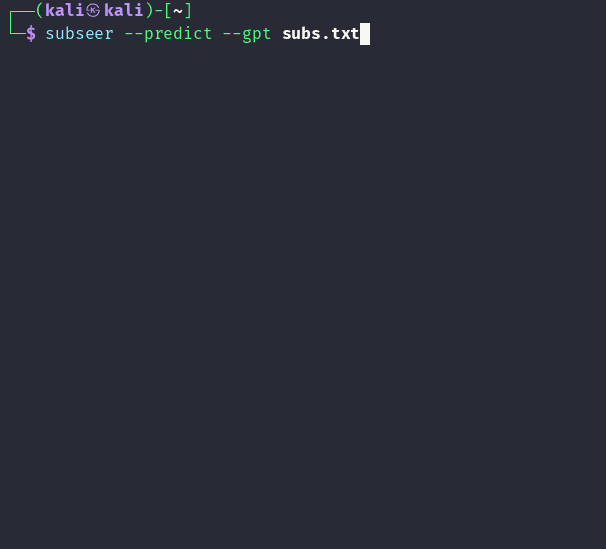

<p align="center">
  
</p>

<h1 align="center">subseer</h1>

<p align="center"><i>sees the subs you don't</i></p>

<p align="center">
  
</p>

Subseer generates new subdomains from the ones you already know. It runs offline, and
can optionally use an LLM to predict names your data alone won't reveal.

Built for authorized recon (bug bounty / pentest).

## Contents

- [Install](#install)
- [LLM providers](#llm-providers)
  - [Auto-tuning](#auto-tuning)
- [Modes](#modes)
  - [Mine](#mine)
  - [Fuzz](#fuzz)
  - [Predict](#predict)
- [Usage](#usage)
- [Logging](#logging)

## Install

```bash
pipx install git+https://github.com/Raymond-JV/subseer
```

For OpenAI (`--gpt`), set your API key:

```bash
export OPENAI_API_KEY=sk-...
```

For a local model (`--ollama`), start the Ollama server:

```bash
ollama serve
```

## LLM providers

AI is required for `Predict` and enhances `Mine`.

| Flag | Provider | Default model |
|---|---|---|
| `--gpt [MODEL]` | OpenAI-compatible (reads `$OPENAI_API_KEY`) | `gpt-4o-mini` |
| `--ollama [MODEL]` | local Ollama (`ollama serve`) | `qwen2.5` |

`--gpt MODEL` and `--ollama MODEL` pick a specific model; the defaults are a cheap,
capable starting point — bump to a stronger one for better predictions.

`--api-base URL` sets the endpoint. With `--gpt` it can be any OpenAI-compatible API
(Groq, Together, vLLM); with `--ollama` it's your Ollama server (default
`localhost:11434`).

### Auto-tuning

The auto-tune flags default to `auto`, but you can also specify them manually.

| Flag | `auto` behavior |
|---|---|
| `--sample` | subs sent to the model as context (~2k, more for huge lists) |
| `--ai-runs` | model calls: enough to send every sub once (max 10) |

Large lists don't fit in one prompt, so subseer shuffles your list and splits it
across calls:

- Each call gets the next slice of up to `--sample` subs, so every sub is sent once.
- Auto uses at most 10 calls. If your list needs more, the run says how much was
  sent (e.g. `covers 52%`); set `--ai-runs` higher to send all of it.
- Extra runs reshuffle and send the list again in new groupings.
- Results are merged and deduplicated.

## Modes

With no mode flag, `subseer` defaults to **Mine + Fuzz**.

| Mode | AI |
|---|---|
| Mine | optional — an LLM enriches its slots |
| Fuzz | none — fully offline |
| Predict | required — needs an LLM |

### Mine

```bash
subseer subs.txt --mine
```

Tokenizes your hosts into slots, then fills every combination — including ones
you haven't deployed. Give it four hosts with two slots:

| host | `{service}` | `{env}` |
|---|---|---|
| api.dev.example.com | api | dev |
| web.dev.example.com | web | dev |
| api.prod.example.com | api | prod |
| mail.prod.example.com | mail | prod |

`{service}` = {api, web, mail}, `{env}` = {dev, prod}. Mine expands the full 3×2 grid
and emits the combinations you're missing:

```
mail.dev.example.com
web.prod.example.com
```

`--min-values` (default `auto`) sets how many distinct values a slot needs. Higher
values cut noise on large lists.

Enhance the scan with AI.

```bash
subseer subs.txt --mine --gpt
```

An LLM can enrich the slots with values you don't have:

`{env}` = {dev, prod} → also **staging**, **qa**

so the grid grows to 3×4 and you also get:

```
api.staging.example.com
web.staging.example.com
mail.staging.example.com
api.qa.example.com
web.qa.example.com
mail.qa.example.com
```

It can also discover a new slot that isn't in your data. Here it infers your hosts are
split by region and adds a `{region}` slot:

`{region}` = {us, eu, ap}

```
us.api.dev.example.com
eu.api.dev.example.com
ap.api.dev.example.com
```

It may also suggest more values for the new slot:

`{region}` = {us, eu, ap} → also **ca**, **sa**, **me**, **af**

### Fuzz

```bash
subseer subs.txt --fuzz
```

The `fuzz` mode runs fully offline and generates permutations of your subdomains —
similar to tools like `gotator` and `altdns`.

It uses SecLists'
[`subdomains-top1million-20000.txt`](https://github.com/danielmiessler/SecLists/blob/master/Discovery/DNS/subdomains-top1million-20000.txt)
by default, but you can specify your own with `-w` / `--wordlist`:

```bash
subseer subs.txt --fuzz -w wordlist.txt
```

| Technique | Example |
|---|---|
| Separator swap | `api-dev` → `api.dev`, `apidev` |
| Plural toggle | `asset` → `assets` |
| Affix strip | `dev-portal` → `portal` |
| Number range | `node2` → `node0` … `node50` |
| Environment swap | `dev` → `qa`, `staging`, `uat`, `prod` |
| Region swap | `us-east-1` → `eu-west-1`, `ap-south-1` |
| Data-center swap | `iad` → `sjc`, `fra` |
| Country swap | `us` → `uk`, `de`, `jp` |
| Version swap | `v1` → `v2`, `v3` |
| Color swap | `blue` → `green` |
| Instance swap | `primary` → `replica`, `standby` |
| Direction swap | `east` → `west` |
| First-label brute | `api.example.com` → `admin.example.com` |
| Word fill | `store-api` → `shop-api` |

### Predict

```bash
subseer subs.txt --predict --gpt
```

```bash
subseer subs.txt --predict --ollama
```

The `predict` mode uses an LLM to infer likely subdomains from your list.

## Usage

<!-- usage:start -->
```
usage: subseer [-h] [-d DOMAIN] [-q] [-v] [--mine] [--min-values N] [--fuzz]
               [-w PATH] [--predict] [--predict-count N] [--gpt [MODEL]]
               [--ollama [MODEL]] [--api-base URL] [--sample N] [--ai-runs N]
               [-o PATH] [--limit N]
               [input]

Generate new subdomains from the ones you already know. Runs offline by
default (Mine + Fuzz); add --gpt or --ollama to use an LLM.

positional arguments:
  input                File of subdomains, one per line.

options:
  -h, --help           show this help message and exit
  -d, --domain DOMAIN  A single domain instead of a file.
  -q, --quiet          Results and errors only.
  -v, --version        Show the version and exit.

Mine (offline):
  Fill the naming patterns found in your list.

  --mine               Run Mine.
  --min-values N       Distinct values a slot needs (default auto).

Fuzz (offline):
  Permute each host offline.

  --fuzz               Run Fuzz.
  -w, --wordlist PATH  Wordlist (default: bundled SecLists top 20k, or
                       $SUBSEER_WORDLIST).

Predict (needs an LLM):
  An LLM infers likely subdomains from your list.

  --predict            Run Predict.
  --predict-count N    Max names to request (default 1000).

LLM:
  Required for Predict; enhances Mine.

  --gpt [MODEL]        OpenAI-compatible model (default gpt-4o-mini). Reads
                       $OPENAI_API_KEY.
  --ollama [MODEL]     Local Ollama model (default qwen2.5).
  --api-base URL       LLM endpoint (default: OpenAI, or localhost:11434 for
                       --ollama).
  --sample N           Subs sent to the model per call (default auto).
  --ai-runs N          Model calls (default auto: enough to send every sub,
                       max 10).

Output:
  -o, --out PATH       Write to a file (default: stdout, progress on stderr).
  --limit N            Max results (default 200000; 0 = no limit).
```
<!-- usage:end -->

## Logging

Each run is appended to `~/.subseer/logs.jsonl` for debugging, one JSON line per
run. Set `$SUBSEER_LOG_DIR` to log somewhere else.

